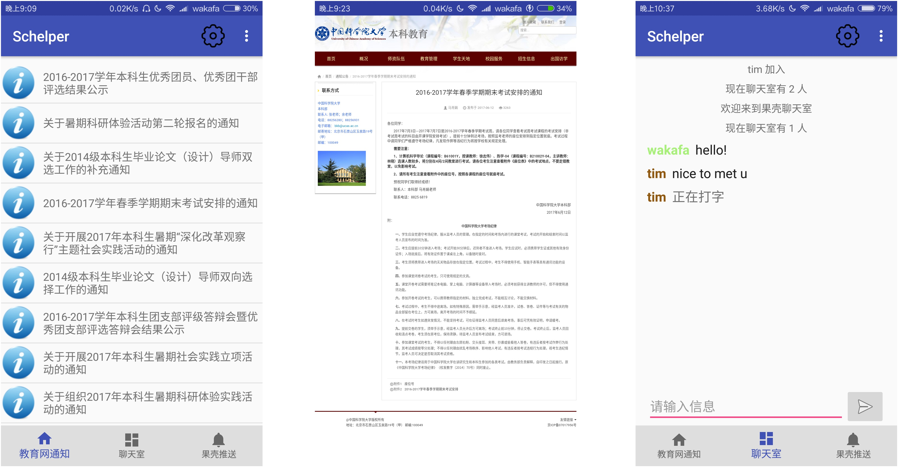

# Schelper
Schelper is an Android app used to facilitate information transition among students in UCAS.

Now, features are as follows.

- Notification from education network  (http://bkjy.ucas.ac.cn/)
  
  with instant refresh, quick view of web pages and timing updates and reminders (building)

- UCAS chatting room
  free chat environment supporting emoij, images(buliding) and files(building)

- UCAS push
  collect news and wechat-push involving UCAS & CAS
  
:
 
